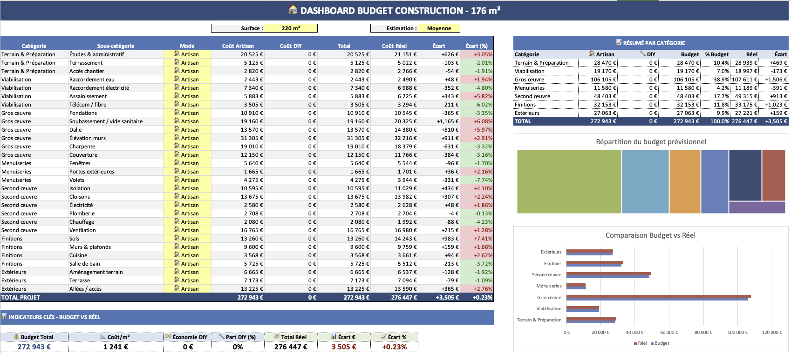

# Budget Construction Excel

Outil avancé de suivi budgétaire et de gestion des dépenses pour projets de construction et rénovation de maison, développé sous Excel avec Power Query et VBA.

Ce projet constitue le prototype fonctionnel original du projet web `budget_construction`, actuellement en cours de migration vers une architecture moderne Python + React.

---

# Aperçu du projet

Ce classeur Excel a été conçu pour centraliser et automatiser le suivi financier complet d'un chantier de construction :

- gestion des devis
- suivi des factures
- estimations DIY (Do It Yourself)
- suivi fournisseurs
- catégorisation produits
- calculs budgétaires
- consolidation des coûts réels
- reporting et recherche

L'objectif initial était de remplacer un processus manuel complexe par un système structuré, maintenable et automatisé, sur demande de l'utilisateur final.

Le projet a ensuite évolué vers une future web app full-stack basée sur :
- FastAPI
- PostgreSQL
- React
- Docker

---

# Fonctionnalités principales

## Gestion budgétaire chantier
- suivi du budget prévisionnel
- comparaison budget vs dépenses réelles
- consolidation automatique des coûts

## Gestion des transactions
- devis
- factures
- estimations DIY

## Gestion fournisseurs
- annuaire fournisseurs
- association des achats aux fournisseurs

## Organisation des produits
- catégories
- sous-catégories
- produits détaillés

## Recherche et filtrage
- recherche multi-critères
- vues filtrées dynamiques

## Pipeline Power Query
- transformation et enrichissement des données
- normalisation des entrées utilisateur
- génération de tables analytiques

## VBA
- automatisation de workflows Excel
- synchronisation de données
- export des requêtes Power Query

---

# Architecture des données

Le projet utilise une architecture proche d'un mini système BI / Data Engineering dans Excel.

## Tables principales

| Table | Rôle |
|---|---|
| `dim_produits` | Catalogue principal des produits |
| `tbl_sous_produits` | Détail et variantes des produits |
| `tbl_fournisseurs` | Référentiel fournisseurs |
| `input_staging` | Zone de staging des données utilisateur |
| `input_staging_enriched` | Données enrichies via Power Query |
| `fact_transactions` | Consolidation des transactions |
| `fact_couts` | Table analytique des coûts |
| `r_search_filters` | Filtres de recherche |
| `r_search_results` | Résultats de recherche |

---

# Pipeline de données

```text
Saisie utilisateur
    ↓
Tables de staging
    ↓
Transformation Power Query
    ↓
Enrichissement des données
    ↓
Tables analytiques
    ↓
Recherche / Reporting / Dashboard
```

---

# Stack technique

## Excel
- Tables structurées
- Formules avancées
- Validation de données
- Interface utilisateur

## Power Query
- langage M
- transformation de données
- enrichissement
- normalisation

## VBA
- automatisation
- export
- synchronisation
- gestion de workflow

---

# Structure du repository

```text
budget_construction_excel/
│
├── workbook/
│   └── budget_construction.xlsm
│
├── src/
│   ├── power-query/
│   └── vba/
│
├── docs/
│   ├── screenshots/
│   ├── architecture.md
│   ├── power-query.md
│   └── data-model.md
│
└── README.md
```

---

# Objectif du projet

Ce projet avait plusieurs objectifs :

- structurer un processus métier réel
- centraliser les données chantier
- réduire les erreurs manuelles
- automatiser les calculs et consolidations
- préparer une migration vers une architecture web scalable

---

# Migration vers une web app

Ce prototype Excel sert désormais de base fonctionnelle au projet :

## Repo associé
`budget_construction`

## Stack cible
- Python
- FastAPI
- PostgreSQL
- SQLAlchemy
- React
- Docker

## Objectifs de la migration
- multi-utilisateur
- API REST
- persistance base de données
- architecture scalable
- UX moderne
- reporting avancé

---

# Compétences démontrées

## Data
- modélisation de données
- transformation ETL
- structuration analytique
- consolidation de données

## Développement
- VBA
- logique métier
- automatisation
- architecture applicative

## Produit / métier
- analyse des besoins
- conception d'outil métier
- optimisation de workflow
- reporting financier

---

# Captures d'écran

## Dashboard principal


- recherche produit
- suivi budget
- tables analytiques
- pipeline Power Query

---

# Installation

## Prérequis
- Microsoft Excel
- Macros activées

## Ouverture
1. Télécharger le fichier `.xlsm`
2. Activer les macros VBA
3. Rafraîchir les requêtes Power Query si nécessaire


## Configuration Google Apps Script
Ce fichier Excel utilise Google Apps Script pour ouvrir une page d'upload de documents.
Pour des raisons de sécurité, l'ID réel du script n'est pas inclus dans le code source.
Remplacez <GOOGLE_APPS_SCRIPT_DEPLOYMENT_ID> par votre propre ID de déploiement.

---

# Notes

Ce repository représente la version Excel historique et fonctionnelle du projet.

Le développement actif se poursuit désormais sur la version web full-stack :
`budget_construction`

---

# Auteur

Yoann Robert

Projet personnel développé sur demande d'un utilisateur final souhaitant orchestrer la construction de sa maison sans passer par un constructeur professionnel.
Ce projet s'inscrit naturellement dans le cadre d'une montée en compétence dans les domaines suivants :
- Data
- Automation
- Développement full-stack
- Architecture applicative
